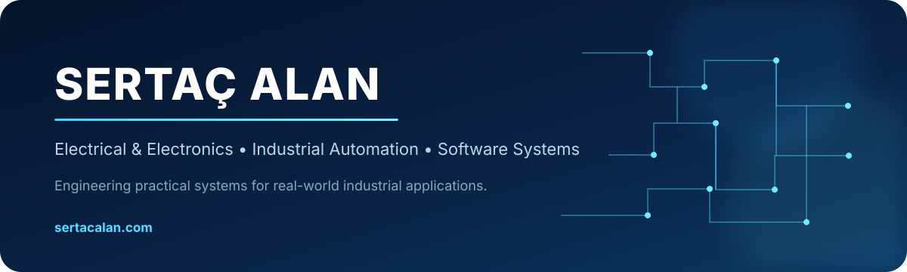
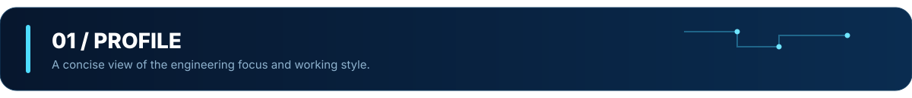
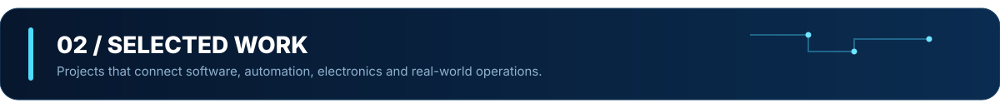
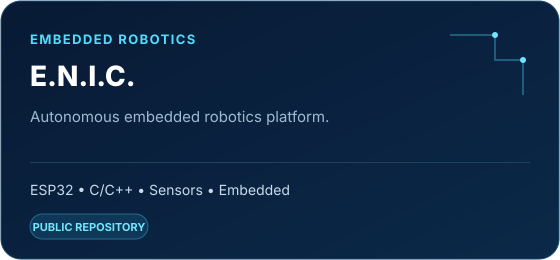
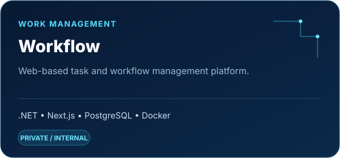
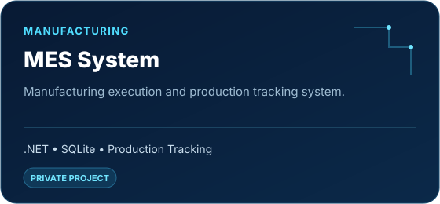
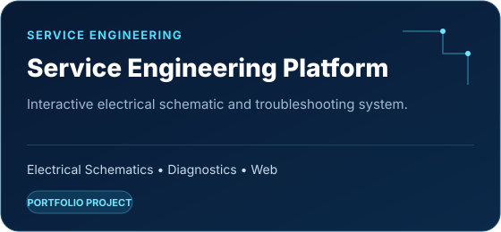
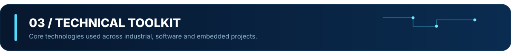
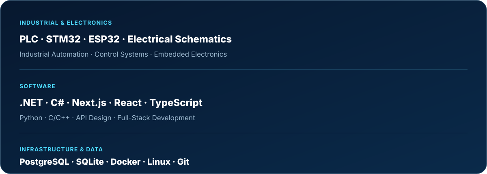
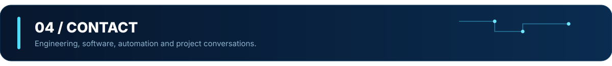

  

  <a href="#profile">Profile</a>&nbsp;&nbsp;·&nbsp;&nbsp;
  <a href="#selected-work">Selected Work</a>&nbsp;&nbsp;·&nbsp;&nbsp;
  <a href="#technical-toolkit">Toolkit</a>&nbsp;&nbsp;·&nbsp;&nbsp;
  <a href="#contact">Contact</a>

  

### Engineering across hardware and software

Focused on **electrical & electronics, industrial automation, software development, and digital technologies**, with an interest in building practical solutions for real-world engineering problems.

<table>
<tr>
<td width="50%" valign="top">

#### What I work on
- Industrial automation and control
- Engineering-focused software systems
- MES and workflow platforms
- Electrical service and schematic tools
- Embedded systems and electronics

</td>
<td width="50%" valign="top">

#### How I like to build
- Practical before flashy
- Clear architecture and documentation
- Real-world usability
- Reliable, maintainable systems
- Hardware + software thinking

</td>
</tr>
</table>

  

<table>
<tr>
<td width="50%" valign="top">

</td>
<td width="50%" valign="top">

</td>
</tr>
<tr>
<td width="50%" valign="top">

</td>
<td width="50%" valign="top">

</td>
</tr>
</table>

> Some production and internal projects are shown as portfolio work only; their source code is not public.

  

  

  

### Let's build something useful.

For engineering, software, automation, or project conversations:

**[Website](https://sertacalan.com)** &nbsp;·&nbsp; **[LinkedIn](https://www.linkedin.com/in/sertacalan/)** &nbsp;·&nbsp; **[GitHub](https://github.com/sertacalansa)**

  

